# Overview

Framework for testing Salesforce applications

- Reusable functions are defined in `User.js`.
- Data for each test case is defined in `Data.xlsx`.
- `Dropdowns.xlsx` contains lists of values for [RVL dropdowns](https://rapisedoc.inflectra.com/Guide/rvl_editor/#param-dropdowns).
- `Output.xlsx` is used to persist data between test executions (see SetOutputValue, GetOutputValue common functions below).
 
The way of test parameterization and reading data from an Excel spreadsheet is described in the docs:

[Data-Driven Testing](https://rapisedoc.inflectra.com/Guide/ddt/)

## Browser Profiles

The framework includes a [local browser profile](https://rapisedoc.inflectra.com/Guide/browser_settings/#local-browser-profiles) located in `Profiles\BrowserProfiles` folder. It is a profile for Chrome. The profile to use is specified in `User.js` file and is used globally by all test cases:

```javascript
g_browserLibrary = "Chrome";
```

You may change the profile in `User.js` or pass `g_browserLibrary` value from SpiraTest or via command line.

## Common Functions

All functions are defined in [User.js](User.js). Look into this file for details.

**Note:** If you are on Rapise 6.6+ you may use global `Sfdc` object.

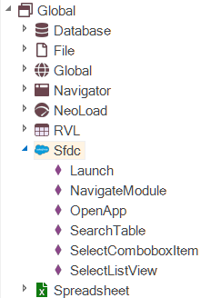

Every function with `Sfdc` prefix is now also an action of `Sfdc` (without the prefix). These two variants are equavalent:

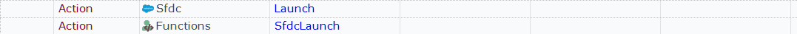

### SfdcLaunch

Launches Salesforce in a browser. SfdcUrl, UserName, Password must be set in Config.xlsx

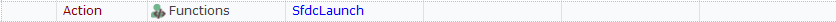

### SfdcOpenApp

Opens application.


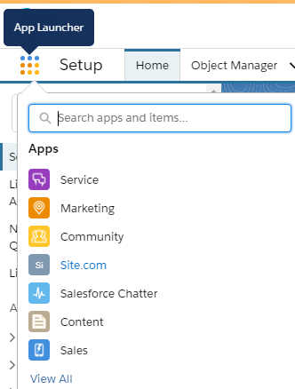

### SfdcNavigateModule

Navigates to module using nav bar.

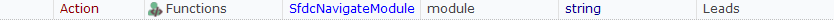


### SfdcSelectListView

Selects list view.

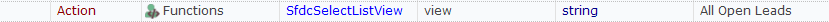

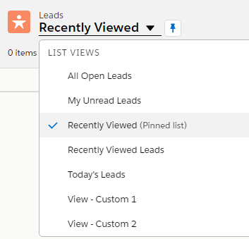

### SfdcSearchTable

Searches data in a table.

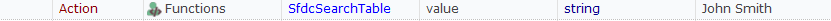

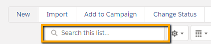

### SfdcSelectComboboxItem

Selects item from a combobox.

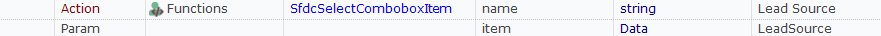

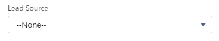

### SetOutputValue

Writes key/value pair to Output.xlsx

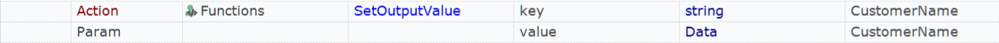

### GetOutputValue

Reads value from Output.xlsx

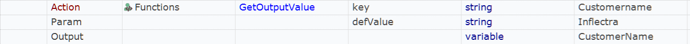