# Overview

Framework for testing Salesforce applications

- Reusable actions are defined in `Sfdc` module.
- Data for each test case is defined in `Data.xlsx`.
- `Dropdowns.xlsx` contains lists of values for [RVL dropdowns](https://rapisedoc.inflectra.com/Guide/rvl_editor/#param-dropdowns).
- `Output.xlsx` is used to persist data between test executions (see SetOutputValue, GetOutputValue common functions below).
 
The way of test parameterization and reading data from an Excel spreadsheet is described in the docs:

[Data-Driven Testing](https://rapisedoc.inflectra.com/Guide/ddt/)

## Browser Profiles

The framework includes a local Chrome [browser profile](https://rapisedoc.inflectra.com/Guide/browser_settings/#local-browser-profiles) located in `Profiles\SeleniumProfiles` folder. This profile is configured to launch Chrome with the same user data profile to deal with MFA in Salesforce. It launches Chrome with these arguments:

```javascript
["disable-notifications", "user-data-dir=C:\\ProgramData\\Inflectra\\Rapise\\Temp\\Chrome"]
```

## Common Actions

All actions are defined in `Sfdc` module and implemented in `Sfdc.js`. Look into this file for details.

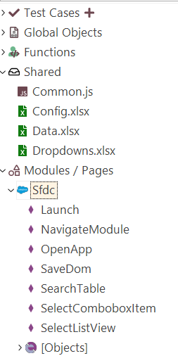

### Sfdc.Launch

Launches Salesforce in a browser. SfdcUrl, UserName, Password must be set in Config.xlsx

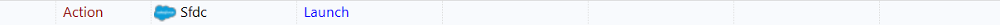

### Sfdc.OpenApp

Opens application.

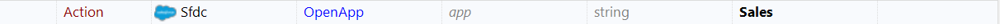

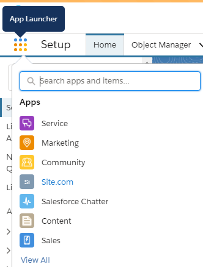

### Sfdc.NavigateModule

Navigates to module using nav bar.

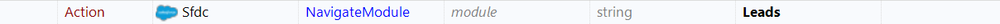


### Sfdc.SelectListView

Selects list view.


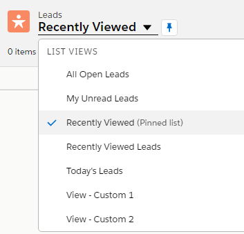

### Sfdc.SearchTable

Searches data in a table.

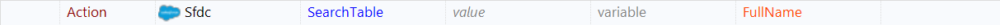

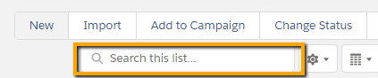

### Sfdc.SelectComboboxItem

Selects item from a combobox.

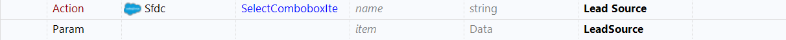

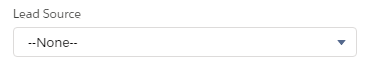

### SetOutputValue

Writes key/value pair to Output.xlsx

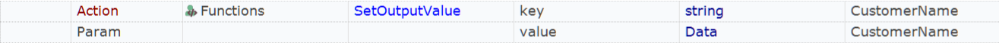

### GetOutputValue

Reads value from Output.xlsx

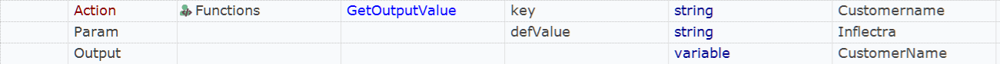